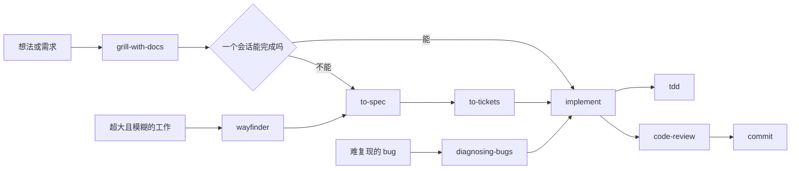

# mattpocock/skills 项目分析报告

> 分析日期：2026-08-06  
> 本地目录：`D:\superagents\.claude\ThirdParty\skills-main`  
> 上游仓库：<https://github.com/mattpocock/skills>

## 结论

这是一个面向编码 agent 的工程工作流库，不是传统应用程序或代码类库。仓库的主体是 Markdown skill，Node.js、Bash 和 GitHub Actions 只负责安装辅助、版本同步和发布。

项目的主要价值不在某一条提示词，而在整套组织方法：用 router 说明 skill 之间的关系，用用户调用与模型调用区分权限，用 `CONTEXT.md` 和 ADR 保存长期上下文，再把需求澄清、规格、拆票、实现、测试和审查串成一条工程流程。

内容设计已经比较成熟，发布结构也很清楚；工程保障相对薄弱，目前没有测试目录和 `test` 脚本，CI 只负责发版。对 `superagents` 而言，适合把它作为第三方研究材料保留，分批提炼方法，不适合整包直接合并。

## 一、本地快照状态

### 1. 文件与版本

分析时的统计结果：

| 项目 | 数量或状态 |
|---|---:|
| 文件总数 | 152 |
| Markdown 文件 | 101 |
| skill 总数 | 35 |
| 正式发布 skill | 25 |
| 只能由用户调用 | 20 |
| 允许模型自动调用 | 15 |
| 测试目录 | 无 |
| `test` 脚本 | 无 |
| GitHub Actions workflow | 1 个，仅用于 Release |

[package.json](./package.json) 与 [.claude-plugin/plugin.json](./.claude-plugin/plugin.json) 的版本都是 `1.2.2`。`npm run check-plugin-version` 已实际执行并通过。

2026-08-06 核对上游时，GitHub 最新 tag 是 `v1.2.2`，远程 `main` 和该 tag 解引用后都指向提交 `8b36d4fb2635b3c21998dcd8144439c9e5ba7302`。因此本地声明的版本与当时的上游最新发布一致。由于本地目录没有独立的 `.git`，无法证明所有文件与上游逐字节相同。

### 2. 这不是独立 clone

在该目录执行 `git rev-parse --show-toplevel`，返回的是父仓库 `D:/superagents`。父仓库将整个 `skills-main` 目录视为未跟踪内容。

这意味着：

- 不能在这里直接查看原项目的本地提交历史。
- 不能把这里当作上游 clone 执行正常的 `git pull`、切分支或回退。
- `git log` 显示的是 `superagents` 的历史，不是 `mattpocock/skills` 的历史。
- 研究上游变更时，应查看 GitHub，或者另建真正的 clone。

## 二、项目定位

[README.md](./README.md) 把项目定位为一组可组合的工程 skill，用来处理 agent 开发中的几类常见问题：

- 需求没有对齐。
- agent 不了解项目领域语言，输出啰嗦且命名不一致。
- 缺少可靠反馈回路，生成的代码不能工作。
- 代码结构持续恶化，模块越来越浅，修改越来越分散。

它不是一个强制接管全部开发流程的框架。作者倾向于提供一组较小的 skill，让使用者按需要组合。

### 技术构成

| 类型 | 用途 |
|---|---|
| Markdown | skill 正文、人类文档、ADR、维护规则 |
| YAML | `agents/openai.yaml`，声明 Codex/OpenAI 展示信息与调用策略 |
| JSON | npm、Changesets、Claude Code plugin 清单 |
| Bash | 本地链接、列举 skill、人工操作向导、安全 hook |
| JavaScript | 同步 `package.json` 与 plugin 版本 |
| GitHub Actions | 根据 Changesets 创建版本 PR 和 tag |

项目没有运行时依赖。[package.json](./package.json) 中只有 `@changesets/cli` 和 `@changesets/changelog-github` 两个开发依赖。

## 三、目录结构

```text
skills-main/
├── .agents/          # 维护规范、安装文案、调用规则和 ADR
├── .changeset/       # Changesets 发版配置
├── .claude-plugin/   # Claude Code plugin 与 marketplace 清单
├── .github/          # Release workflow
├── .out-of-scope/    # 已拒绝需求的知识库
├── docs/             # 面向人的 skill 说明页
├── scripts/          # 维护者脚本
├── skills/           # skill 正文与配套资源
├── CHANGELOG.md
├── CLAUDE.md         # 本仓库维护规则
├── CONTEXT.md        # 本仓库领域词汇表
├── README.md
└── package.json
```

`skills/` 下分为几类：

| 目录 | 数量 | 是否正式发布 | 用途 |
|---|---:|---|---|
| `engineering/` | 18 | 是 | 日常工程工作 |
| `productivity/` | 7 | 是 | 非代码工作流 |
| `misc/` | 4 | 否 | 保留但不主推的 skill |
| `in-progress/` | 6 | 否 | 公开试验中的 skill |
| `deprecated/` | 0 | 否 | 已废弃内容，目前只有说明文件 |

[CLAUDE.md](./CLAUDE.md) 明确规定，只有 `engineering/` 和 `productivity/` 可以进入 README、docs 和 plugin 清单。实测这 25 个正式 skill 与 `.claude-plugin/plugin.json` 完全一致，没有漏项或多发。

## 四、skill 的组织模型

### 1. 两种调用方式

项目把 skill 分成两类：

- 用户调用：必须由人显式输入，例如 `/grill-me`、`/to-spec`、`/implement`。
- 模型调用：用户可以显式调用，agent 也可以根据 `description` 自动触发，例如 `tdd`、`diagnosing-bugs`、`code-review`。

用户调用的 skill 同时使用两处配置：

```yaml
disable-model-invocation: true
```

```yaml
policy:
  allow_implicit_invocation: false
```

本次检查中，35 个 skill 的这两处策略全部一致，skill 名称也都与目录名一致。

### 2. router 与公共能力

[ask-matt](./skills/engineering/ask-matt/SKILL.md) 是整套系统的 router。它不直接完成工程任务，而是告诉用户当前应该走哪条路径。

多个轻量 wrapper 复用模型调用 skill：

- `grill-me` 只负责启动 `grilling`。
- `grill-with-docs` 同时启动 `grilling` 和 `domain-modeling`。
- `implement` 组合 `tdd` 与 `code-review`。
- `improve-codebase-architecture` 组合 `codebase-design`、`grilling` 与 `domain-modeling`。

这种写法减少了重复规则。真正的行为约束放在公共 skill 中，入口 skill 只负责编排。

## 五、主工作流



### 1. 需求澄清

`grilling` 把设计问题组织成一棵决策树。当前所有前置条件已经确定、可以立即提问的节点称为 frontier。它一次提出整个 frontier 的问题，用户回答后再计算下一轮。

`grill-with-docs` 在访谈过程中调用 `domain-modeling`：

- 术语确定后写入 `CONTEXT.md`。
- 遇到含糊或冲突的词，立即要求澄清。
- 只有难以逆转、缺少背景就难以理解、并且确实存在取舍的决定才写 ADR。

### 2. 规格与拆票

`to-spec` 不重新访谈，而是把当前对话和代码理解整理成规格，并发布到项目配置的 issue tracker。

`to-tickets` 将规格拆成 tracer-bullet ticket：每个 ticket 都要形成一条可以独立验证的纵向切片，并声明 blocking edges。对无法纵向切分的大范围机械修改，它采用 expand-contract。

### 3. 实现与测试

`implement` 的流程很短：读取规格或 ticket，在预先确认的 seam 上运行 TDD，持续做类型检查和单文件测试，最后跑完整测试套件，再调用 `code-review`。

`tdd` 的重点包括：

- 从公共接口验证行为，不测试内部实现。
- 测试 seam 要事先与用户确认。
- 每次只写一个失败测试，再写最少实现使其通过。
- 避免实现耦合测试、同义反复测试和横向批量写测试。

项目当前把 TDD 定义为 red-green，不在这个循环内做 refactor。refactor 被移到 review 阶段。

### 4. 双轴审查

`code-review` 将审查拆成两个互不污染上下文的子任务：

- Standards：是否符合仓库规则和基础代码异味判据。
- Spec：是否完整、准确地实现原始需求，有没有遗漏或越界。

最终结果保持两条轴分开，不把它们合并成一个总分。

### 5. 调试

`diagnosing-bugs` 最有价值的约束是：在提出根因假设之前，先建立一条能够稳定变红的反馈回路。

完整流程是：

1. 建立快速、确定、能捕获用户实际症状的命令。
2. 复现并最小化。
3. 生成 3 至 5 个可证伪假设并排序。
4. 每次只验证一个变量。
5. 先写回归测试，再修复。
6. 删除调试代码并做复盘。

如果无法建立反馈回路，skill 要求停止猜测，转而索取环境、HAR、日志、core dump 或临时生产观测权限。

## 六、做得好的地方

### 1. 系统边界清楚

正式、试验、杂项、废弃内容分目录管理，发布清单只包含正式 skill。人类文档、agent 指令、plugin 清单和 router 各有自己的职责。

### 2. 使用共享词汇降低上下文成本

`CONTEXT.md` 只保存领域词汇，不保存实现细节。ADR 只记录难以逆转且存在真实取舍的决定。这种分工能减少重复解释，同时避免把词汇表写成杂乱的项目笔记。

### 3. 强调可验证反馈

`diagnosing-bugs`、`tdd`、`to-tickets` 和 `code-review` 都要求产物能够独立验证。它们关注 agent 是否真的获得反馈，而不是只要求“认真检查”。

### 4. skill 写作方法有体系

[writing-for-agents](./skills/productivity/writing-for-agents/SKILL.md) 提出了一套适合继续研究的写作方法：

- context pointer 的措辞决定 agent 是否会读取目标材料。
- 区分长期占用上下文的 context load 与由人记忆 skill 的 cognitive load。
- 按信息层级决定哪些内容内联，哪些放到引用文件。
- 每条规则保持单一事实源。
- 删除不会改变模型行为的 no-op 指令。
- 使用已经存在的概念作为 leading word，避免反复解释同一行为。

### 5. 当前清单质量较好

本次自动检查确认：

- 25 个正式 skill 与 plugin 清单完全一致。
- 35 个 skill 名称无重复，名称与目录匹配。
- 所有 skill 都有 `agents/openai.yaml`。
- 用户调用策略与 OpenAI policy 一致。
- `package.json` 和 plugin 版本一致。
- 现有 Node 与 Bash 脚本语法检查通过。

## 七、问题与风险

### 1. 缺少自动化质量门禁

[.github/workflows/release.yml](./.github/workflows/release.yml) 只执行 `npm ci` 和 Changesets 发版，没有自动执行：

- `claude plugin validate . --strict`
- `npm run check-plugin-version`
- skill 名称、目录、调用策略一致性检查
- README、docs、router、plugin 清单对应关系检查
- Markdown 链接检查
- Bash 与 Node 语法检查

当前状态是自洽的，但主要依赖维护者手工遵守 [CLAUDE.md](./CLAUDE.md)。这类仓库最容易出现的不是运行时 bug，而是规则漂移和清单漏项。

### 2. 部分实现写死 Claude 工具名

仓库宣称 skill 可以用于不同模型，但部分正文直接依赖 Claude 风格的工具接口：

- `code-review` 要求使用 `Agent` tool 和 `general-purpose` subagent。
- `improve-codebase-architecture` 要求使用 `subagent_type=Explore`。
- 多处直接使用 `/clear`、`/compact` 等 Claude Code 会话命令。

这些概念可以迁移到 Codex、Pi 和 OpenCode，但调用语法不能照搬。

### 3. 部分自动动作权限过大

以下行为如果进入具有更严格权限纪律的仓库，需要改写：

| 位置 | 默认行为 | 风险 |
|---|---|---|
| `implement` | 完成后直接 commit | 用户可能只授权实现，没有授权提交 |
| `resolving-merge-conflicts` | 永不 abort，并自动 stage、commit、继续 rebase | 遇到不可兼容意图时缺少停止条件 |
| `prototype` | 创建临时分支并提交原型 | 模型自动触发后会扩大 Git 变更范围 |
| `research` | 模型自动触发并向仓库写 Markdown | 普通研究请求未必授权写文件 |
| `to-spec` | 直接发布到 issue tracker | 对外写入前缺少最终预览确认 |
| `scripts/link-skills.sh` | 同名目标不是软链接时执行 `rm -rf` | 可能删除用户已有的自定义 skill 目录 |

其中 [scripts/link-skills.sh](./scripts/link-skills.sh) 虽然标明仅供维护者使用，但删除目标前没有备份或确认，不能直接用于 `superagents`。

### 4. 与现有规则存在冲突

`superagents` 已有 `constitution` 和 `grill`。直接安装本项目后，至少会产生以下冲突：

- 当前 `grill` 一次只追一个点；这里的 `grilling` 一次提出整个 frontier。
- 当前总纲要求不确定和破坏性操作停下确认；部分第三方 skill 会自动 commit、rebase 或向外发布。
- 当前总纲区分讨论与执行阶段；`research`、`prototype` 等模型调用 skill 可能从回答任务直接跳到写文件或建分支。
- 当前项目要求中文产出；第三方 skill 全部按英文场景设计。

### 5. TDD 文案与实际流程不一致

[README.md](./README.md) 和 `tdd` 的 description 仍使用 `red-green-refactor`，但 [tdd/SKILL.md](./skills/engineering/tdd/SKILL.md) 明确说 refactor 不属于循环。

项目自己的 docs 页承认这个差异，并链接到仍未关闭的 [Issue #589](https://github.com/mattpocock/skills/issues/589)。保留 `red-green-refactor` 主要是为了触发词兼容，不代表实际执行 refactor。

### 6. Codex plugin 发行受目录结构限制

[ADR 0002](./.agents/adr/0002-ship-as-a-claude-code-plugin.md) 说明了没有原生 Codex plugin 的原因：

- Claude Code plugin 可以逐个列出多个 skill 路径。
- Codex plugin 的 `skills` 只能配置一个根路径，并递归发现其中的所有 `SKILL.md`。
- 如果指向整个 `skills/`，会把 `misc/`、`in-progress/` 等非正式内容一起发布。
- 软链接目录在 Codex 安装复制阶段不会保留。

因此当前 Codex 安装方式是：

```bash
npx skills@latest add mattpocock/skills
```

## 八、对 superagents 的借鉴价值

### 第一批值得重点研究

| 来源 | 值得吸收的部分 | 需要改写的部分 |
|---|---|---|
| `writing-for-agents` | context pointer、信息层级、单一事实源、no-op 判断 | 重新整理为中文规则，避免引入自造词和英文写作风格 |
| `diagnosing-bugs` | 先建立 red-capable 反馈回路、最小化、可证伪假设 | 与现有失败处理、测试驱动规则合并，补充权限停止条件 |
| `code-review` | Standards 与 Spec 双轴审查 | 改为 Codex 的多 agent 工具，并服从项目代码审查输出格式 |
| `codebase-design` | deep module、seam、locality、deletion test | 术语要重新校准，避免与现有中文规则和 DDD 词汇冲突 |

### 等 skill 数量增多后再考虑

`ask-matt` 的 router 模式值得保留。当前 `superagents` 只有 `constitution` 和 `grill`，单独建 router 收益不大。正式 skill 增多后，再增加一个中文入口，说明各 skill 的触发边界和组合方式。

### 暂时不建议吸收

- `implement`：过度绑定作者自己的完整工作流，并默认 commit。
- `resolving-merge-conflicts`：缺少可停止或 abort 的分支。
- `prototype`：默认分支和提交策略不符合现有权限纪律。
- `wayfinder`：高度依赖 issue tracker、子 issue、阻塞关系和多会话协作。
- `wizard`：功能实用，但涉及 `.env`、GitHub secrets 和人工外部操作，安全边界需要单独设计。
- `scripts/link-skills.sh`：存在直接删除同名目录的行为。

## 九、建议的研究顺序

后续阅读可以按以下顺序进行，先看系统，再看单项细节：

1. [README.md](./README.md)：了解作者试图解决的问题。
2. [CLAUDE.md](./CLAUDE.md)：了解仓库的发布和维护不变量。
3. [ask-matt/SKILL.md](./skills/engineering/ask-matt/SKILL.md)：掌握全部 skill 的关系图。
4. [writing-for-agents/SKILL.md](./skills/productivity/writing-for-agents/SKILL.md) 与 [SKILL-MECHANICS.md](./skills/productivity/writing-for-agents/SKILL-MECHANICS.md)：研究 skill 写作方法。
5. [diagnosing-bugs/SKILL.md](./skills/engineering/diagnosing-bugs/SKILL.md)：研究反馈回路和调试阶段门禁。
6. [tdd/SKILL.md](./skills/engineering/tdd/SKILL.md) 与 [code-review/SKILL.md](./skills/engineering/code-review/SKILL.md)：研究实现后的验证方式。
7. [codebase-design/SKILL.md](./skills/engineering/codebase-design/SKILL.md) 与 [domain-modeling/SKILL.md](./skills/engineering/domain-modeling/SKILL.md)：研究共享词汇和模块设计。
8. `to-spec`、`to-tickets`、`wayfinder`：最后研究整套 issue tracker 工作流。
9. `scripts/`、`prototype`、`wizard`、`resolving-merge-conflicts`：带着权限和破坏性操作视角审查。

## 十、验证记录

本次分析实际执行了以下检查：

```bash
npm run check-plugin-version
node --check scripts/sync-plugin-version.mjs
bash -n scripts/link-skills.sh
bash -n scripts/list-skills.sh
bash -n skills/engineering/wizard/template.sh
bash -n skills/engineering/diagnosing-bugs/scripts/hitl-loop.template.sh
bash -n skills/misc/git-guardrails-claude-code/scripts/block-dangerous-git.sh
git ls-remote https://github.com/mattpocock/skills.git HEAD refs/heads/main 'refs/tags/v1.2.2*'
```

检查结果：

- 版本同步检查通过。
- 上述 Node 与 Bash 文件语法检查通过。
- 远程 `main` 与 `v1.2.2` 解引用后都指向 `8b36d4f`。
- 自动清单检查通过，没有发现正式 skill 漏发、名称不匹配或调用策略不一致。
- 没有测试目录和 `test` 脚本，因此不能声称项目经过自动化行为测试。

## 十一、总体判断

这个项目值得研究，但研究重点应放在它如何组织 agent 行为，而不是照抄所有正文。

最值得保留的原则是：先对齐再实现、用领域词汇减少重复解释、把工作切成可验证的纵向路径、调试前先建立可靠反馈、审查时把规范与需求分开。

需要明确舍弃的部分是：默认 commit、无条件继续 rebase、模型自动写报告、直接发布外部 issue，以及删除本地同名目录。这些行为与 `superagents` 现有的阶段纪律和权限边界不兼容。
